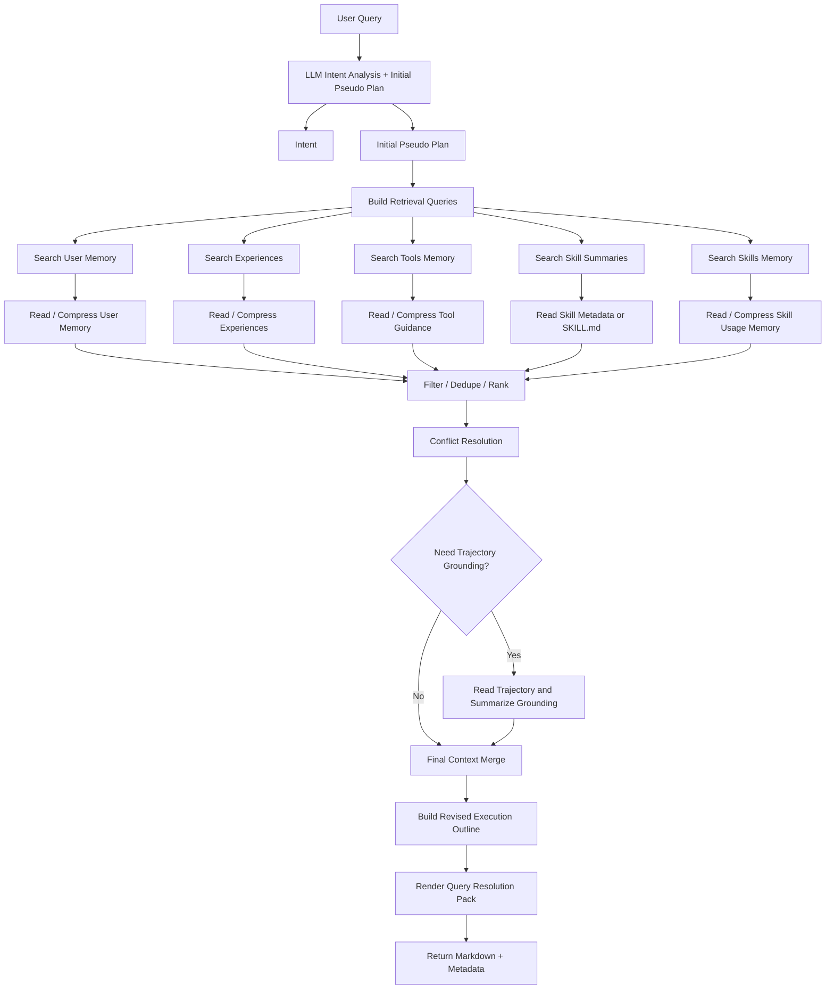

# Query Resolution Pack：复用现有 Agent Memory 与 Skill 的动态聚合方案

## 1. 背景与目标

本文档整理一个不新增 OpenViking 记忆结构的运行时方案：当用户提出一个 query 时，OpenViking 侧动态检索并组合现有的 User Memory、Agent Memory、Experience、Trajectory grounding、Tools Memory、Skills/SKILL.md，形成一个临时的 Query Resolution Pack，并通过 search-resolution 接口返回给调用方。调用方可以把这个聚合产物注入 Agent、展示给测试页面，或作为后续执行模块的输入。

核心目标：

- 不新增 OpenViking memory type。
- 不新增长期落盘结构。
- 复用现有 `profile`、`preferences`、`entities`、`events`、`trajectories`、`experiences`、`tools`、`skills`、`session_skills` 和 `SKILL.md`。
- 借鉴 plan-guided retrieval 和分层检索的思想，但不引入外部方案的数据结构。
- 每次 query 到来时生成一个临时聚合体，接口返回后即结束，不作为长期 memory 落盘。
- 当前方案只做 OpenViking 侧检索、裁决、聚合和返回；Agent 执行与执行后 commit 是下游可选集成。
- 如果调用方在 Agent 执行后触发现有 memory commit，仍然复用 trajectory、experience 和 session skill 的沉淀流程。

一句话概括：

> 在每个用户 query 到来时，OpenViking 动态检索现有 User Memory、Agent Experience、Trajectory grounding、Tools Memory、Skills/SKILL.md，经过 intent analysis、pseudo-plan、rerank/filter/conflict resolution 后，组装成一个临时 Query Resolution Pack，并由 search-resolution 接口返回一份可直接用于指导 Agent 的内容；是否注入 Agent、是否执行后 commit，由调用方决定。

---

## 2. 可复用的现有结构

### 2.1 User Memory

现有 user memory 包括：

- `profile`
- `preferences`
- `entities`
- `events`

用途：

- 识别用户身份背景。
- 识别用户长期偏好。
- 识别项目、人、概念等实体上下文。
- 识别历史事件、承诺、决策、时间线。

### 2.2 Agent Memory

现有 agent memory 包括：

- `trajectories`
- `experiences`
- `tools`
- `skills`
- `identity`
- `soul`

其中本方案重点使用：

- `experiences`：可直接指导当前 query 的抽象经验。
- `trajectories`：通常不直接注入，只作为 experience grounding 或冲突裁决依据。
- `tools`：复用为工具级使用经验，承载单工具或工具组合的调用注意事项。
- `skills`：记录 skill 使用统计、推荐流程、失败模式等。

### 2.3 Skill 资产

现有 Skill 资产包括：

- `viking://agent/{agent_space}/skills/{skill_name}/SKILL.md`
- workspace 下的 `skills/{skill_name}/SKILL.md`
- session skill extraction 产出的 `session_skills`

用途：

- 提供任务执行流程。
- 提供工具组合说明。
- 提供用户显式要求长期遵循的任务规范。
- 作为当前 query 的可注入执行能力。

---

## 3. 分层检索思想在本方案中的映射

本方案把 query-time 需要的指导信息分成三层：

- Planning layer：任务级检索导航。
- Functional layer：可复用任务流程。
- Atomic layer：单工具或工具组合的使用规范。

本方案不新增这些结构，而是做如下映射：

| 分层概念 | OpenViking 复用方式 | 是否新增长期结构 |
|---|---|---|
| Planning layer | query-time 先生成临时 pseudo-plan，并用它扩展检索 query；检索完成后可生成 revised execution outline 进入返回内容，但不落盘、不作为强制执行脚本 | 否 |
| Functional layer | 现有 `SKILL.md`、`session_skills`、skills memory | 否 |
| Atomic layer | 现有 `tools` memory、工具相关 `SKILL.md`、tool schema | 否 |

关键原则：

- Planning layer 用于 query-time 的两段式流程：先生成 initial pseudo-plan 做检索导航，再用检索结果修正为 revised execution outline。
- Initial pseudo-plan 只用于扩展检索 query，不直接返回给 Agent 作为执行依据。
- Revised execution outline 可以进入 Query Resolution Pack，但必须标注为建议性执行导航，不是长期记忆，也不是强制执行脚本。
- Functional layer 复用现有 `SKILL.md`。
- Atomic layer 复用现有 `tools` memory 与 tool schema。
- Trajectory 不作为直接执行材料，而作为 evidence / grounding。
- Experience 是最重要的可注入 agent execution guidance。

### 3.1 OpenViking 现有资产的职责边界

Query Resolution Pack 不是把所有检索结果简单拼接到一起，而是按不同资产类型承担不同职责：

| 来源 | 进入 Pack 后的职责 | 注入原则 |
|---|---|---|
| User Memory: `profile` | 用户身份、长期背景、稳定上下文 | 只保留和当前 query 相关的身份/背景，不注入无关 profile |
| User Memory: `preferences` | 输出风格、长期偏好、用户约束 | 当前 query 显式要求优先于历史 preference |
| User Memory: `entities` | 项目、人、组织、概念等实体背景 | 只保留影响当前 query 理解的实体 |
| User Memory: `events` | 历史承诺、决策、时间线 | 只保留和当前任务有因果关系的事件 |
| Agent Memory: `experiences` | 抽象执行策略、可复用路径、反模式 | 高相关 experience 可直接进入 Pack，是核心执行指导 |
| Agent Memory: `trajectories` | source evidence、grounding、冲突裁决 | 默认不直接注入，只在需要时压缩成 grounding note |
| Agent Memory: `tools` | 单工具或工具组合的使用经验 | 只保留当前 likely tools 相关的注意事项 |
| Agent Memory: `skills` | skill 使用统计、推荐流程、失败模式 | 用于 skill rerank 和注入模式选择 |
| Skill: `SKILL.md` / `session_skills` | 可执行流程、工具组合、领域任务规范 | 按相关度和长度选择 full / summary / on-demand |

这个职责边界的目的是避免三类常见问题：

- 把 profile、events 等弱相关内容当作执行指导。
- 把 trajectory 的历史细节误注入当前任务。
- 把 skill 全量塞入上下文，导致预算被低价值内容占用。

---

## 4. Query Resolution Pack 的定义

Query Resolution Pack 是每次用户 query 到来时生成的临时运行时对象。

它不是 memory type，也不落盘。它是 OpenViking search-resolution 接口的主要返回内容。

它的核心职责不是“把搜到的内容都返回”，而是完成一次 query-time resolution：

1. 理解 query 的意图、领域、风险和信息需求。
2. 只基于 query、intent、session_context 生成用于扩展检索的 initial pseudo-plan。实现上 Step 1 和 Step 2 可由同一次 LLM 调用返回，以降低模型调用成本。
3. 基于 plan step 构造多来源 retrieval queries。
4. 并发检索现有 user memory、experience、tools memory、skills、skills memory。
5. materialize 高分候选，读取必要摘要或正文。
6. 对候选内容做跨来源过滤、去重和排序。
7. 做冲突裁决，并判断是否需要 trajectory grounding。
8. 合并最终 selected context。
9. 基于最终上下文生成 revised execution outline。
10. 组装并返回 Markdown Pack 和可测试/可观测的结构化 metadata。

建议逻辑结构：

```json
{
  "query": "用户原始问题",
  "resolution_id": "临时请求 id，便于测试和日志追踪",
  "intent": {
    "task_type": "当前任务类型",
    "domain": "任务领域",
    "requires_tools": true,
    "requires_write": false,
    "risk_level": "read_only | write | external_effect",
    "likely_tools": ["read_file", "openviking_search"],
    "needs": {
      "user_memory": true,
      "experience": true,
      "trajectory_grounding": false,
      "skills": true,
      "tools_memory": true
    }
  },
  "initial_pseudo_plan": [
    {
      "step": "用于扩展检索的临时子目标",
      "retrieval_queries": ["派生检索 query"]
    }
  ],
  "selected_context": {
    "user_memory": [],
    "agent_experiences": [],
    "trajectory_grounding": [],
    "tool_guidance": [],
    "skills": []
  },
  "selection_rationale": [
    {
      "source": "experience",
      "uri": "viking://agent/default/memories/experiences/example.md",
      "reason": "task_type、domain、likely_tools 均匹配",
      "score": 0.78,
      "content_mode": "full | summary | link_only"
    }
  ],
  "discarded_or_deferred": [
    {
      "source": "trajectory",
      "uri": "viking://agent/default/memories/trajectories/example.md",
      "reason": "内容过长且 experience 已足够，只保留为可选 grounding"
    }
  ],
  "conflicts": [
    {
      "items": ["preference:old", "query:current"],
      "resolution": "当前 query 显式要求优先"
    }
  ],
  "revised_execution_outline": [
    "检索结果修正后的建议性执行导航，不是强制脚本"
  ],
  "pack_markdown": "最终返回给调用方、可直接注入 Agent 的 Markdown 内容",
  "debug": {
    "retrieval_queries": [],
    "budgets": {},
    "latency_ms": {}
  }
}
```

对调用方最重要的是 `pack_markdown`。它推荐使用 Markdown 形式：

```md
# Query Resolution Pack

## Original Query
...

## Intent
...

## Relevant User Memory
...

## Relevant Agent Experience
...

## Relevant Skills
...

## Tool Guidance
...

## Suggested Execution Outline
...
```

### 4.1 Pack 内容的约束

- `initial_pseudo_plan` 是检索导航器，只放在结构化 metadata 中，默认不进入 `pack_markdown`。
- `revised_execution_outline` 可以进入 `pack_markdown`，但标题必须使用 `Suggested Execution Outline`，避免被理解成强制计划。
- `pack_markdown` 只包含经过选择的内容，不包含所有候选。
- `selection_rationale`、`discarded_or_deferred`、`conflicts` 用于测试和观测，可按开关返回。
- 如果没有足够相关内容，接口仍应返回一个最小 Pack，明确说明未找到高置信 memory / skill，并给出基于 query 的轻量 outline。

### 4.2 Pack 返回内容与 Agent 执行的关系

OpenViking search-resolution 接口只负责返回 Pack，不直接执行用户任务。

调用方可以选择：

- 把 `pack_markdown` 注入 Agent 的 system / developer / pre-user context。
- 把 `pack_markdown` 展示给测试页面，用于人工检查检索质量。
- 只读取结构化字段，自己决定如何注入。

因此，Pack 的输出应满足两个目标：

- 对 Agent 足够可执行：包含意图、相关经验、技能、工具注意事项和建议性 outline。
- 对测试足够可解释：包含来源、分数、选择理由、冲突处理和未选原因。

---

## 5. 总体流程

OpenViking search-resolution 的完整流程可以拆成两段：前半段做 query 理解和检索 query 扩展，后半段做多来源并发检索、统一裁决和渲染。

```text
User Query
  ↓
1+2. LLM Query 分析 + Initial Pseudo Plan
  ↓
3. 构造 retrieval queries
  ↓
4. 并发检索候选
   ├─ user memory: profile / preferences / entities / events
   ├─ agent experiences
   ├─ tools memory
   ├─ skills / SKILL.md summary
   └─ agent skills memory
  ↓
5. 并发读取高分候选详情
   ├─ memory full content / summary
   ├─ experience full content / summary
   ├─ skill metadata / optional SKILL.md content
   └─ tool guidance detail
  ↓
6. 候选内容过滤、去重、排序
  ↓
7. 冲突裁决与 trajectory grounding 判断
   ├─ 无需 grounding: 继续
   └─ 需要 grounding: 读取 source trajectory 并压缩为 grounding note
  ↓
8. 合并最终 selected_context
  ↓
9. 基于最终 selected_context 生成 Revised Execution Outline
  ↓
10. 组装并返回 pack_markdown + structured metadata
```

对应的并发 DAG 可以表示为：



### 5.1 可并发与不可并发步骤

可并发：

- User memory、experiences、tools memory、skills summary、skills memory 的检索可以并发。
- 各来源高分候选的 `read_content` / summary 压缩可以并发，但需要全局预算控制。
- Skill summary rerank 和 tools guidance rerank 可以与 memory 详情读取并发。
- Debug metadata 的整理可以和 `pack_markdown` 渲染并发，只在 response 前合并。

不建议并发：

- Query 分析和 initial pseudo-plan 逻辑上有先后关系，但二者输入都只来自 query / session_context，实际实现可以合并为一次 LLM 调用，同时返回 `intent` 和 `initial_pseudo_plan`。
- Retrieval query expansion 需要等 initial pseudo-plan 生成后再做。
- 冲突裁决需要等主要候选过滤后再做。
- Trajectory grounding 读取应延迟到冲突裁决之后，避免默认读取长轨迹。
- Revised execution outline 应在冲突裁决和 grounding 之后生成。

推荐实现方式：

- 使用 fan-out / fan-in：`RetrievalQueryBuilder` 之后并发检索，`CandidateRanker` 前合并。
- 每一路检索设置独立 timeout 和 limit，某一路失败不阻塞整体 Pack 返回。
- response 中记录每一路的 `latency_ms`、命中数量、失败原因，便于测试 search-resolution 的召回质量。

### 5.2 LLM 调用成本与 Prompt 管理

为了控制成本，search-resolution 不为每个逻辑步骤都单独调用模型。当前推荐实现最多使用四次 LLM：

| 节点 | 作用 | 是否可合并 |
|---|---|---|
| `intent_and_initial_plan` | 一次返回 `intent` 和 `initial_pseudo_plan` | 已合并 Step 1 + Step 2 |
| `retrieval_query_build` | 把 pseudo-plan 转成各来源检索 query | 依赖 pseudo-plan，单独调用 |
| `conflict_trajectory_decision` | 判断冲突和是否需要 trajectory grounding | 依赖 selected context，单独调用 |
| `revised_execution_outline` | 基于最终上下文生成建议性执行 outline | 依赖冲突裁决和 grounding，单独调用 |

Trajectory grounding 本身是 OpenViking 检索和读取，不默认额外调用 LLM。若未来需要对长 trajectory 做模型压缩，应单独加开关和预算。

Prompt 不内联在业务代码里，统一使用 OpenViking 现有 prompt manager：

- `openviking/prompts/templates/query_resolution/intent_and_initial_plan.yaml`
- `openviking/prompts/templates/query_resolution/retrieval_queries.yaml`
- `openviking/prompts/templates/query_resolution/conflict_trajectory_decision.yaml`
- `openviking/prompts/templates/query_resolution/revised_execution_outline.yaml`

业务代码通过 `openviking.prompts.render_prompt(prompt_id, variables)` 渲染模板，便于后续版本化、替换模板目录和测试 prompt。

下游调用方拿到返回内容后，可以选择继续：

```text
Query Resolution Pack
  ↓
注入给 Agent 执行
  ↓
Agent 解决用户 Query
  ↓
可选：执行后复用现有 memory commit 流程沉淀 trajectory / experience / session_skills
```

本方案当前只实现第一段，即 OpenViking 侧 retrieval-resolution。第二段属于 Agent runtime 集成，不是 search-resolution 接口的职责。

---

## 6. Step 1：Query 分析

Query 分析默认使用 LLM 做结构化理解。这一步只基于当前 query、session_context 和服务端可见的基础上下文，识别表层关键词之外的显式约束、隐含需求、任务边界和检索需求。

实现上，Query 分析和 Step 2 的 Initial Pseudo Plan 共用一次 LLM 调用：`query_resolution.intent_and_initial_plan`。该调用同时输出 `intent` 和 `initial_pseudo_plan`，但在 pipeline metadata 中仍保留 Step 1 / Step 2 两个逻辑步骤，便于测试和观测。

输入：

- 当前用户 query。
- 当前 session history。
- 当前 channel / user / workspace。

输出：

```json
{
  "task_type": "design_analysis",
  "domain": "openviking_agent_memory",
  "requires_tools": true,
  "requires_write": false,
  "risk_level": "read_only",
  "likely_tools": ["read_file", "rg"],
  "needs": {
    "user_memory": true,
    "experience": true,
    "trajectory_grounding": false,
    "skills": true,
    "tools_memory": true
  }
}
```

Query 分析的职责：

- 判断当前任务类型。
- 判断领域。
- 判断是否需要工具。
- 判断是否有写操作或外部副作用。
- 预测可能使用的工具。
- 决定是否检索 user memory、experience、trajectory、skills、tools memory。

### 6.1 LLM Structured Intent

LLM 要求输出严格 JSON，不直接输出自然语言解释：

```json
{
  "task_type": "research_and_design",
  "domain": "agent_memory_skill",
  "explicit_constraints": [
    "只做 OpenViking 侧检索和 Pack 生成",
    "不开发 Agent 如何消费返回结果"
  ],
  "implicit_needs": [
    "需要评估 plan-guided retrieval 是否适合当前方案",
    "需要评估哪些节点适合引入 LLM"
  ],
  "requires_tools": true,
  "requires_write": false,
  "risk_level": "read_only",
  "likely_tools": ["openviking_find", "openviking_read"],
  "needs": {
    "user_memory": true,
    "experience": true,
    "trajectory_grounding": false,
    "skills": true,
    "tools_memory": true
  }
}
```

LLM 输出必须经过结构校验。结构校验失败、模型超时或模型不可用时，可以使用保守规则作为 fallback，但 fallback 只用于保证接口可用，不作为主方案路径。

示例：

用户 query：

```text
看下外部方案文档，结合 OpenViking 现有 Agent Memory 和 Skill 给方案。
```

分析结果：

```json
{
  "task_type": "research_and_design",
  "domain": "agent_memory_skill",
  "requires_tools": true,
  "requires_write": false,
  "risk_level": "read_only",
  "likely_tools": ["read_file", "rg"],
  "needs": {
    "user_memory": true,
    "experience": true,
    "trajectory_grounding": false,
    "skills": true,
    "tools_memory": true
  }
}
```

---

## 7. Step 2：生成 Initial Pseudo Plan

这一步先基于用户 query 生成一个临时 plan，再用 plan 中的步骤和子目标去扩展后续检索。它发生在主数据检索之前，不能依赖已经召回的 memory、experience 或 skill。

实现上，Initial Pseudo Plan 与 Step 1 的 intent analysis 同一次 LLM 调用返回。这样不会改变链路语义，因为 initial plan 只依赖 query、intent 和 session_context，不依赖主数据检索结果。

这里需要区分两个对象：

- `initial_pseudo_plan`：检索前生成，只作为检索导航器。
- `revised_execution_outline`：检索后生成，可以进入 Pack，作为建议性执行导航。

Initial Pseudo Plan 不落盘，也不作为强制执行脚本。它的作用是：

- 把用户 query 拆成可检索的子目标。
- 暴露隐含的工具需求和信息需求。
- 将模糊 query 改写成更适合检索 experience、memory、skill 的语义 query。
- 避免只用用户原话检索导致召回过窄。

输入：

- 用户原始 query。
- Step 1 的 intent analysis。
- 当前 session 的短上下文。

### 7.1 Plan-Guided Retrieval

这里不是直接用原始 query 检索所有来源，而是用 plan 作为中间层，让后续检索围绕 plan step 展开。OpenViking 在 pseudo-plan 生成前不预先检索主数据，避免把早期召回结果反向污染 query understanding。

```text
task
  ↓
LLM generate a task-specific pseudo-plan
  ↓
retrieve memory / experience / skill / tools memory by each plan step
```

Pseudo-plan 生成流程：

```text
query + intent
  ↓
LLM intent_and_initial_plan(...)
  ↓
输出 structured initial_pseudo_plan
```

LLM 输出建议使用结构化 JSON：

```json
{
  "initial_pseudo_plan": [
    {
      "id": "p1",
      "goal": "分析外部方案中的 plan-guided retrieval 链路",
      "expected_sources": ["skills", "experiences"],
      "retrieval_hints": ["plan-guided retrieval", "pseudo-plan rewrite", "skill retrieval per step"]
    },
    {
      "id": "p2",
      "goal": "对照 OpenViking 当前 memory / skill / experience 结构",
      "expected_sources": ["user_memory", "experiences", "tools_memory"],
      "retrieval_hints": ["OpenViking memory skill query resolution", "existing memory schema reuse"]
    }
  ],
  "plan_confidence": 0.82
}
```

`initial_pseudo_plan` 默认由 LLM rewrite 生成。模型失败、超时或 schema 校验失败时，可以使用模板 plan 作为保守 fallback，但该 fallback 不作为主方案路径。

输出示例：

```md
## Initial Pseudo Plan
1. 读取用户指定的外部方案文档，抽取分层检索和推理阶段使用方式。
2. 对照 OpenViking 当前 Agent Memory、experience、session_skills、SKILL.md 机制。
3. 明确哪些能力可以复用，哪些只做运行时组合。
4. 设计不新增 memory type 的 Query Resolution Pack。
5. 用一个具体 query 示例说明聚合体如何解决任务。
```

同时生成检索子查询：

```json
{
  "retrieval_queries": {
    "user_memory": [
      "用户对 OpenViking memory skill 方案的偏好和约束",
      "用户是否要求不新增 memory type 或不改变现有结构"
    ],
    "experience": [
      "分析外部设计文档并映射到 OpenViking 当前实现的经验",
      "不新增结构前提下复用 existing memory experience skill 的方案经验"
    ],
    "skills": [
      "读取设计文档并提炼分类",
      "定位 OpenViking memory skill 实现入口",
      "综合文档和代码给工程方案"
    ],
    "tools_memory": [
      "read_file 读取设计文档",
      "rg 定位 memory skill implementation"
    ]
  }
}
```

### 7.2 Initial Pseudo Plan 的限制

- 不进入 `pack_markdown`，除非 debug 模式显式要求。
- 不代表 OpenViking 已确认的执行路径。
- 不能覆盖用户原始 query 的显式要求。
- 只能用于扩展检索，不用于直接约束 Agent 行为。

### 7.3 Revised Execution Outline 的生成

检索、过滤、冲突裁决完成后，再基于入选内容生成 `revised_execution_outline`。

输入：

- 用户原始 query。
- intent analysis。
- 入选的 user memory。
- 入选的 experiences。
- 入选的 tools memory。
- 入选的 skills。
- trajectory grounding summary。
- conflicts 的 resolution 结果。

输出示例：

```md
## Suggested Execution Outline
1. 先读取用户指定文档，提炼和当前 query 相关的核心机制。
2. 对照 OpenViking 现有 memory / skill 结构，只映射可复用能力。
3. 明确哪些内容进入 Query Resolution Pack，哪些只作为 grounding。
4. 输出面向调用方的 pack 内容，不假设当前接口会执行 Agent 任务。
```

生成原则：

- 只纳入被检索结果支持的步骤。
- 删除 initial pseudo-plan 中被证明不适用的步骤。
- 把 experience 中的反模式转换成边界提醒。
- 把 selected skill 的关键使用方式转换成执行建议。
- 标题固定为 `Suggested Execution Outline`，避免让调用方误解为强制计划。

---

## 8. Step 3：构造 Plan-Step Based Retrieval Queries

这一步把 `initial_pseudo_plan` 转成多来源检索 query。OpenViking 不只用原始 query 检索 skill / experience，而是用 plan step 作为更稳定的检索入口。

输入：

- 原始 query。
- intent analysis。
- `initial_pseudo_plan`。
- 每个 plan step 的 `expected_sources` / `retrieval_hints`。

输出：

```json
{
  "retrieval_queries": {
    "user_memory": [
      {
        "from": "query",
        "query": "用户对 OpenViking search-resolution 边界的偏好和约束"
      }
    ],
    "experiences": [
      {
        "from": "p1",
        "query": "分析 plan-guided retrieval 并迁移到现有工程结构的经验"
      },
      {
        "from": "p2",
        "query": "不新增 memory type 前提下组合 experience skill tools memory 的方案经验"
      }
    ],
    "skills": [
      {
        "from": "p1",
        "query": "读取外部源码并总结 retrieval pipeline 的 Skill"
      },
      {
        "from": "p2",
        "query": "设计 OpenViking 接口和方案文档的 Skill"
      }
    ],
    "tools_memory": [
      {
        "from": "p1",
        "query": "rg read_file 阅读 GitHub 源码和本地文档的工具经验"
      }
    ]
  }
}
```

生成规则：

- user memory query 重点保留用户偏好、显式约束、长期背景。
- experience query 优先按 plan step 检索类似任务路径和反模式。
- skill query 必须绑定具体 step，避免“skill”词面相似导致误召回。
- tools memory query 只为需要工具的 step 生成。
- 每条 query 保留 `from` 字段，方便 debug 和后续 rerank 解释。

Retrieval query 默认由 LLM 根据 step、source 和 retrieval goal 改写生成。LLM 改写失败时，可以临时使用 plan step 文本直接拼接 query 作为 fallback。

---

下面四节都属于 Step 4 的 fan-out 并发检索。实现上应并发执行，不需要等某一类候选完成后再检索下一类候选。

## 9. Step 4：并发检索候选 - User Memory

检索范围：

- `profile`
- `preferences`
- `entities`
- `events`

目标：

- 找到和当前 query 以及 pseudo-plan 子目标有关的用户偏好。
- 找到和当前项目相关的长期背景。
- 找到用户对输出形式、语言、深度、风险边界的要求。

示例检索结果：

```md
- 用户偏好中文回答。
- 用户关注 OpenViking Agent Memory V2。
- 用户希望方案贴近当前实现，不要引入额外结构。
```

过滤原则：

- 只保留和当前 query 有直接关系的 memory。
- 不注入无关 profile。
- 不注入无关 events。
- 当前 query 的显式要求优先级高于历史 memory。

---

## 10. Step 4：并发检索候选 - Agent Experience

检索范围：

```text
viking://agent/{agent_space}/memories/experiences
```

目标：

- 找类似任务的历史经验。
- 找过去已经总结好的执行规则。
- 指导当前任务的执行方式。

推荐检索 query 由以下内容拼接：

```text
用户原始 query
+
query intent
+
pseudo-plan 的步骤和子目标
+
likely tools / task type
```

这样比只用用户原始 query 更稳定：pseudo-plan 负责把任务拆成更明确的语义检索入口，再用这些入口召回 experience 和 skill。

示例：

```text
分析外部论文设计并结合 OpenViking 当前 memory/skill 实现给工程方案
task_type: research_and_design
tools: read_file, rg
```

示例 experience：

```md
## Situation
- 用户要求分析设计文档并结合当前代码实现给方案。

## Approach
- 先读设计文档，抽取核心概念。
- 再定位当前仓库实现入口。
- 建立概念映射。
- 输出可落地方案和边界。

## Reflect
- 不要只复述文档。
- 不要提出和当前结构冲突的新抽象。
```

注入原则：

- 高相关 experience 可直接进入 Query Resolution Pack。
- 多个 experience 内容重复时只保留最清晰的。
- 与当前用户显式要求冲突的 experience 不注入。

---

## 11. Step 4：并发检索候选 - Tools Memory

检索范围：

```text
viking://agent/{agent_space}/memories/tools
```

目标：

- 找工具使用经验。
- 找工具常见失败。
- 找推荐调用方式。

示例：

```json
[
  {
    "tool": "rg",
    "guidance": "先用精确关键词定位入口，再读文件，不要直接全仓库大范围读。"
  },
  {
    "tool": "read_file",
    "guidance": "大文件按 offset/limit 分段读取。"
  }
]
```

这里复用现有 tools memory 表达单工具或工具组合的细粒度使用经验，不新增新的长期结构。

实际来源可以是：

- tools memory。
- tool schema。
- 和工具相关的 `SKILL.md`。
- 当前 session 中已观察到的 tool failures。

---

## 12. Step 4：并发检索候选 - Skill

检索范围：

- workspace skills。
- builtin skills。
- `viking://agent/{agent_space}/skills/{skill}/SKILL.md`。
- session skill extraction 产出的 `SKILL.md`。

目标：

- 找当前 query 可直接复用的任务技能。
- 找对 pseudo-plan 中每个关键步骤有帮助的技能文档。
- 找对当前工具使用有帮助的技能文档。
- 找用户显式要求长期遵循的 session skill。

输出示例：

```json
[
  {
    "name": "openviking-doc-analysis",
    "source": "workspace",
    "reason": "适合读取并总结 OpenViking 设计文档",
    "content_mode": "inject_full"
  },
  {
    "name": "repo-code-search",
    "source": "workspace",
    "reason": "适合定位实现入口",
    "content_mode": "summary_only"
  }
]
```

推荐注入策略：

- 1-2 个强相关 skill：直接注入完整内容。
- 中等相关 skill：只注入 summary。
- 很多候选 skill：只注入列表，让 agent 自己 read。
- 缺依赖的 skill 不注入。
- 和当前 query 只是词面相似的 skill 不注入。

---

## 13. Step 5/6/8：Materialize、过滤去重排序与 Final Context Merge

候选来源包括：

- user memory。
- experience。
- tools memory。
- skills。
- source trajectory。
- events。
- entities。

需要先统一过滤、去重、排序，再合并成最终 `selected_context`。`Revised Execution Outline` 必须基于这个干净上下文生成，不能基于原始候选生成。

### 13.1 User Memory 过滤

保留：

- 和输出风格相关。
- 和当前项目相关。
- 和当前用户明确偏好相关。

丢弃：

- unrelated profile。
- unrelated events。
- 和当前 query 显式要求冲突的旧偏好。

### 13.2 Experience 过滤

保留：

- task_type 匹配。
- 工具链匹配。
- 当前 query 的意图匹配。

丢弃：

- 只在别的领域适用。
- 过于具体的旧案例。
- 与当前用户要求冲突。

### 13.3 Trajectory 过滤

默认：

- 不注入正文。
- 只在需要 grounding 时压缩成 summary。

### 13.4 Skills 过滤

保留：

- 和当前任务直接相关。
- 能提升执行质量。
- 内容不太长。
- 依赖满足。

丢弃：

- 只是名字相似。
- 需要未安装依赖。
- 过长但当前只需要一小段。

### 13.5 Tools Memory 过滤

保留：

- 当前 likely_tools 相关。
- 有明确调用建议或失败提醒。

### 13.6 跨来源裁决

过滤不能只在各来源内部做，还需要跨来源统一裁决。

需要输出：

- `selection_rationale`：为什么选择某条 memory / experience / skill。
- `discarded_or_deferred`：为什么某条候选没有进入正文。
- `conflicts`：候选之间、候选与当前 query 之间的冲突，以及采用的解决策略。

裁决规则：

- 当前 query 的显式要求优先于历史 user memory。
- 高相关 experience 优先于具体 trajectory。
- trajectory 只在 experience 低置信、冲突或高风险时作为 grounding。
- skill 的可用性和依赖满足优先于语义相似度。
- tools memory 只对当前 likely tools 生效，不对无关工具泛化。

### 13.7 预算控制

Pack 需要控制返回内容长度，避免 search-resolution 接口返回不可用的大上下文。

推荐预算：

- `pack_markdown` 默认控制在 4k-8k tokens 内。
- user memory 优先保留偏好和约束，少量实体背景。
- experience 优先保留 1-3 条高相关内容。
- skills 默认 summary / link_only，只有强相关且短内容才 full。
- trajectory grounding 默认 0 条，必要时最多 1-2 条压缩 summary。
- debug metadata 可按 `include_debug` 开关返回，避免常规调用过重。

本步骤输出：

- `selected_context`：最终进入 Pack 的 user memory、experience、skills、tool guidance、trajectory grounding。
- `selection_rationale`：解释每个入选项为什么入选。
- `discarded_or_deferred`：解释被丢弃或仅保留链接的候选。
- `conflicts`：当前 query、历史 memory、experience、skill 之间的冲突及裁决结果。

---

## 14. Step 7：冲突裁决与 Trajectory Grounding 判断

Step 7 发生在候选 materialize、过滤、去重、排序之后。LLM 只能看到当前 query、intent、入选候选摘要、source URI、score 和 explicit constraints，不传过长全文，也不要求模型理解任何外部项目背景。

默认不直接读取 trajectory。

原因：

- trajectory 长。
- 偏具体执行记录。
- 不适合直接注入。
- 容易把历史细节误带入当前任务。

只有以下情况才读取 trajectory：

1. experience 置信度低。
2. experience 之间互相冲突。
3. 当前任务高风险。
4. 需要解释某个 experience 为什么存在。
5. 需要从 source trajectory 找 grounding。

保守 fallback 可以使用简单条件：

```text
allow_trajectory_grounding=false
  -> 不读取

selected_experiences 足够且无冲突
  -> 不读取

selected_experiences 为空 / 低分 / 有冲突 / 高风险
  -> 读取 trajectory grounding
```

这个规则只用于模型不可用时的安全兜底；主路径仍然应由 LLM 判断 experience 是否“足够好”、候选之间是否存在语义冲突，以及是否需要额外 trajectory grounding。

LLM trajectory decision 把候选摘要交给模型做结构化裁决：

```json
{
  "conflicts": [
    {
      "items": ["current_query", "user_memory:preferences/openviking-agent.md"],
      "type": "explicit_query_over_historical_preference",
      "resolution": "当前 query 明确要求只做 OpenViking 侧，因此不采纳历史上偏 Agent runtime 的偏好。"
    }
  ],
  "need_trajectory_grounding": true,
  "reason": "selected experiences are weak and the boundary between OpenViking retrieval and Agent runtime is important",
  "grounding_queries": [
    "OpenViking-only search-resolution implementation without Agent consumption",
    "past trajectory where Agent consumption was incorrectly included in retrieval API"
  ]
}
```

trajectory 在聚合体里通常不作为正文注入，而是变成压缩后的 grounding note：

```json
{
  "type": "trajectory_grounding",
  "summary": "过去类似任务中，先读设计文档再核对实现入口，效果更可靠。"
}
```

---

## 15. Step 9：基于 Final Context 生成 Revised Execution Outline

初始 pseudo-plan 用于扩展检索；检索、materialize、过滤、去重、排序、冲突裁决和 trajectory grounding 完成后，再用最终 `selected_context` 生成 `revised_execution_outline`。

输入：

- 用户原始 query。
- intent analysis。
- Step 8 产出的 `selected_context`。
- `selection_rationale`。
- `conflicts` 的 resolution 结果。

修正目标：

- 删除 initial pseudo-plan 中没有被最终上下文支持的步骤。
- 补充 selected experience 中明确提示的必要检查。
- 把 selected skills 的关键使用方式纳入计划。
- 把 selected tools memory 中的失败提醒转换成执行边界。
- 把冲突裁决结果纳入执行边界。

注意：

- revised execution outline 仍然不落盘。
- 它仍然不是强制执行脚本。
- 它可以进入 Query Resolution Pack，作为当前任务的建议性执行导航。
- initial pseudo-plan 默认只进入 debug metadata，不进入 `pack_markdown`。

示例：

```md
## Suggested Execution Outline
1. 读取用户指定的外部方案文档，抽取分层检索和推理阶段使用方式。
2. 对照 OpenViking 当前 Agent Memory、experience、session_skills、SKILL.md 机制。
3. 明确哪些能力可以复用，哪些只做运行时组合。
4. 设计不新增 memory type 的 Query Resolution Pack。
5. 用一个具体 query 示例说明聚合体如何解决任务。
```

---

## 16. Step 10：组装 Query Resolution Pack

最终聚合体示例：

```md
# Query Resolution Pack

## Original Query
看下外部方案文档，结合当前 Agent memory 和 Skill，给个动态组合方案。

## Intent
- Task type: research_and_design
- Domain: OpenViking Agent Memory / Skill
- Risk: read_only
- Likely tools: read_file, rg

## Relevant User Memory
- 用户希望方案复用现有 OpenViking 结构，不新增 memory type。
- 用户关注 Agent Memory V2、trajectory、experience、skill 的工程组合方式。

## Relevant Agent Experience
- 做外部设计对照当前实现时，先抽取外部设计概念，再读当前实现入口，最后做映射和方案。
- 不要只复述论文；必须明确现有结构如何复用。

## Relevant Skills
### Skill: OpenViking 文档分析
- Use when reading design docs and mapping them to implementation.
- Prefer reading design docs first, then implementation files.

## Tool Guidance
- read_file: 大文件分段读取。
- rg: 先搜精确关键词，再扩大范围。
- openviking_search: 适合查语义相关记忆和资源。

## Suggested Execution Outline
1. 抽取外部方案中的分层检索、能力复用和执行指导思路。
2. 映射到 OpenViking 现有 experience / tools memory / SKILL.md。
3. 设计 Query Resolution Pack。
4. 说明检索、过滤、接口返回和下游可选学习闭环。
```

---

## 17. 下游 Agent 注入策略（可选集成）

Search-resolution 接口本身不执行 Agent 任务。调用方拿到 `pack_markdown` 后，如果要接入 Agent runtime，可以分两类注入。

### 16.1 初始上下文注入

在 agent 开始处理 query 前注入：

- Relevant user memory。
- Relevant experience。
- Selected skills。
- Tool guidance。
- Suggested execution outline。

适合：

- read-only 任务。
- analysis 任务。
- planning 任务。
- research/synthesis 任务。

### 16.2 工具调用前再注入

对于写操作或高风险操作，保留现有机制：

```text
如果即将调用 write_file / edit_file
  ↓
再检索 experience
  ↓
注入 Relevant Agent Experience
```

这个机制负责在高风险操作前提醒 agent：

- 过去类似任务的边界。
- 不该重复的错误。
- 写操作前需要确认的条件。
- 当前工具的安全使用方式。

建议保留现有 `exp_write_tools` 配置，并将检索 query 从“最近三条 user message”增强为：

```text
current query + query intent + revised execution outline + likely write target + candidate tool name
```

---

## 18. 下游执行后沉淀策略（可选集成）

Search-resolution 请求内不触发 commit。调用方如果把 Pack 注入 Agent 并完成任务，可以在执行结束后继续走现有 commit 流程：

```text
session.commit()
  ↓
Phase 1: trajectory extraction
  ↓
Phase 2: experience consolidation
  ↓
可选：session_skills extraction
  ↓
tools / skills memory 更新
```

### 17.1 什么时候沉淀 trajectory

如果任务包含：

- 多步骤操作。
- 工具调用。
- 明确成功/失败结果。
- 有可复用边界。

则适合沉淀 trajectory。

### 17.2 什么时候沉淀 experience

如果 trajectory 体现了：

- 可泛化策略。
- 重要反模式。
- 工具调用顺序。
- 任务边界。
- 用户确认过的正确做法。

则适合 consolidate 成 experience。

### 17.3 什么时候沉淀 session_skills / SKILL.md

如果用户明确表达：

- “以后都这样”。
- “每次遇到这类任务都按这个流程”。
- “记住这个处理规范”。
- “这个可以作为一个 skill”。

则复用现有 `session_skills` 提取到 `SKILL.md`。

### 17.4 什么时候更新 tools / skills memory

如果本次任务中出现：

- 工具成功使用模式。
- 工具失败模式。
- 工具组合经验。
- skill 使用成功/失败经验。

则可以更新：

- `tools` memory。
- `skills` memory。

---

## 19. 端到端示例

用户 query：

```text
看下外部方案文档，理解它的分层检索和执行指导方式，结合当前 Agent memory 和 Skill，给一个不新增记忆结构的方案。
```

### 18.1 Query 分析

```json
{
  "task_type": "design_synthesis",
  "domain": "agent_memory_skill",
  "requires_tools": true,
  "requires_write": false,
  "risk_level": "read_only",
  "likely_tools": ["read_file", "rg"]
}
```

### 18.2 检索结果

User Memory：

```md
- 用户要求方案不要新增 OpenViking 记忆结构。
- 用户关注 Agent Memory V2 中 trajectory / experience 的应用。
```

Experience：

```md
- 分析外部设计时，必须先抽取外部概念，再映射到当前实现。
- 给方案时要区分“已有能力可复用”和“需要运行时编排”。
```

Skills：

```md
- 文档分析 Skill。
- OpenViking 实现定位 Skill。
```

Tool Guidance：

```md
- read_file 适合读取指定设计文档。
- rg 适合定位当前实现中的 memory / skill 入口。
```

### 18.3 Search-Resolution 返回聚合体

```md
# Query Resolution Pack

## Intent
用户要基于外部方案文档，设计一个复用 OpenViking 现有 memory/skill 的 query-time 聚合方案。

## Constraints
- 不新增 OpenViking memory type。
- 不新增长期结构。
- 聚合体只在运行时生成。
- 当前接口只负责返回用于解决 query 的检索聚合内容。

## Relevant Experience
- 外部论文设计需要先抽象概念，再和当前实现逐项映射。
- 不要直接照搬论文结构；优先复用当前已有 memory、experience、tools、skills。

## Relevant Skills
- 文档分析 Skill：用于读取设计文档并抽取核心机制。
- 代码定位 Skill：用于查找当前实现入口。

## Tool Guidance
- 先读指定文档。
- 再用 rg 定位 OpenViking 当前 memory/skill 入口。
- 最后输出流程、数据来源、接口返回内容和下游可选沉淀方式。

## Suggested Execution Outline
1. 读取用户指定的外部方案文档。
2. 提炼分层检索、能力复用和执行指导方式。
3. 映射到现有 experience / tools memory / SKILL.md。
4. 设计 Query Resolution Pack。
5. 给出 OpenViking search-resolution 的 query-time 流程。
```

### 18.4 下游 Agent 使用聚合体回答用户

最终回答聚焦：

- 外部方案的关键分层思想是什么。
- OpenViking 现在已有啥。
- 不新增结构怎么复用。
- query 来时怎么动态组合。
- 组合体怎么解决 query。
- 下游执行后可选怎么沉淀回现有 memory。

### 18.5 下游执行后学习

如果本次任务质量高，commit 后现有机制可以沉淀：

- trajectory：记录“读取外部设计文档 → 对照当前实现 → 输出复用现有结构方案”的执行轨迹。
- experience：总结“外部设计对照 OpenViking 实现时，应先抽象概念，再映射现有结构，避免新增无必要结构”。
- session_skills：仅当用户明确要求“以后都按这个方式分析论文/设计”时才生成。

---

## 20. 最小落地版本

建议先做最小闭环，不改底层 memory schema。

### Phase 1：Query Resolution Pack

实现：

1. LLM query intent analysis。
2. LLM initial pseudo-plan 生成，只基于 query / intent / session_context。
3. LLM 构造 plan-step retrieval queries。
4. 并发检索 user memory / experiences / tools memory / skills / skills memory。
5. materialize 高分候选，读取必要摘要或正文。
6. filter / dedupe / rank，生成 `selection_rationale` 和 `discarded_or_deferred`。
7. LLM conflict resolver + trajectory grounding decision。
8. 合并最终 `selected_context`。
9. LLM revised execution outline。
10. pack 组装并通过 `/api/v1/search/resolution` 返回。

不做：

- 不新增 memory type。
- 不新增 skill subtype。
- 不自动创建新的 SKILL.md。
- 不直接注入 trajectory 正文。
- 不在 OpenViking 接口内执行 Agent 任务。
- 不在 search-resolution 请求内触发 memory commit。

### Phase 2：增强过滤和注入

增加：

- LLM candidate self-filter / rerank。
- 更严格的 JSON schema 校验和自动修复。
- 更细的 per-source timeout / score threshold 配置。
- 更细粒度的 skill full / summary / link_only 注入模式。
- write tool 前二次 experience 检索增强，供 Agent runtime 集成使用。

### Phase 3：复用现有 commit 做学习闭环

这是下游 Agent 执行后的可选集成，不属于 search-resolution 接口本身。

保留现有：

- trajectory extraction。
- experience consolidation。
- session_skills extraction。
- tools / skills memory update。

只优化提取质量，不改结构。

---

## 21. OpenViking Search-Resolution 接口

为了测试和落地该方案，可以新增一个 OpenViking 侧接口：

```text
POST /api/v1/search-resolution
```

或者挂在现有 search router 下：

```text
POST /api/v1/search/resolution
```

推荐使用第二种，语义上属于 search 的增强能力。

### 21.1 Request

```json
{
  "query": "用户原始 query",
  "agent_space": "default",
  "user_ids": ["user_1"],
  "session_id": "optional-session-id",
  "session_context": [
    {
      "role": "user",
      "content": "可选的短上下文"
    }
  ],
  "include_debug": true,
  "limits": {
    "user_memory": 5,
    "experiences": 5,
    "tools_memory": 5,
    "skills": 5,
    "trajectory_grounding": 2,
    "pack_max_tokens": 8000
  },
  "options": {
    "return_markdown": true,
    "return_structured": true,
    "allow_trajectory_grounding": true,
    "skill_content_mode": "auto"
  }
}
```

字段说明：

- `query`：必填，当前用户 query。
- `agent_space`：必填或使用服务端默认 agent space。
- `user_ids`：可选，用于检索相关 user memory。
- `session_context`：可选，只传最近少量上下文，不传完整长历史。
- `include_debug`：是否返回检索 query、候选、分数、丢弃原因等信息。
- `limits`：控制各来源召回数量和最终 Pack 长度。
- `skill_content_mode`：`auto | full | summary | link_only`。

### 21.2 Response

```json
{
  "resolution_id": "sr_20260101_xxx",
  "query": "用户原始 query",
  "pipeline_steps": [
    {
      "id": "step1_query_analysis",
      "name": "Query analysis",
      "status": "ok",
      "latency_ms": 1
    },
    {
      "id": "step6_filter_dedupe_rank",
      "name": "Filter, dedupe, and rank",
      "status": "ok",
      "latency_ms": 12
    },
    {
      "id": "step9_revised_execution_outline",
      "name": "Revised execution outline",
      "status": "ok",
      "latency_ms": 1
    }
  ],
  "pack_markdown": "# Query Resolution Pack\n...",
  "intent": {
    "task_type": "design_synthesis",
    "domain": "agent_memory_skill",
    "risk_level": "read_only",
    "likely_tools": ["read_file", "rg"]
  },
  "selected_context": {
    "user_memory": [],
    "agent_experiences": [],
    "trajectory_grounding": [],
    "tool_guidance": [],
    "skills": []
  },
  "revised_execution_outline": [],
  "selection_rationale": [],
  "discarded_or_deferred": [],
  "conflicts": [],
  "debug": {
    "initial_pseudo_plan": [],
    "retrieval_queries": {},
    "raw_candidates": {},
    "budgets": {},
    "latency_ms": {}
  }
}
```

### 21.3 Pack Markdown 模板

```md
# Query Resolution Pack

## Original Query
...

## Intent
- Task type:
- Domain:
- Risk:
- Likely tools:

## Constraints And Preferences
...

## Relevant User Memory
...

## Relevant Agent Experiences
...

## Relevant Skills
...

## Tool Guidance
...

## Trajectory Grounding
...

## Suggested Execution Outline
...

## Notes For The Agent
- Treat this pack as guidance for the current query only.
- Prefer the user's explicit request over historical memory when they conflict.
- Do not assume omitted memories or skills are irrelevant globally; they were only not selected for this query.
```

### 21.4 服务端实现建议

新增一个轻量 builder，不改底层 memory schema：

```text
SearchResolutionService.resolve(request)
  ↓
IntentAnalyzer.analyze(query, session_context)
  - LLM structured intent with schema validation
  ↓
PseudoPlanGenerator.generate_initial(intent, query)
  - LLM initial pseudo-plan based on query / intent / session_context
  ↓
RetrievalQueryBuilder.expand(query, intent, initial_pseudo_plan)
  - LLM-generated plan-step based retrieval queries
  ↓
fan-out 并发检索:
  ├─ UserMemoryRetriever.retrieve(...)
  ├─ ExperienceRetriever.retrieve(...)
  ├─ ToolsMemoryRetriever.retrieve(...)
  ├─ SkillSummaryRetriever.retrieve(...)
  └─ SkillMemoryRetriever.retrieve(...)
  ↓
fan-out 并发读取 / 压缩高分候选:
  ├─ read selected user memories
  ├─ read selected experiences
  ├─ read selected tool guidance
  ├─ read selected skill metadata / SKILL.md
  └─ read selected skill memory
  ↓
fan-in 合并候选
  ↓
CandidateRanker.filter_dedupe_rerank(...)
  - vector score + source budget + content hash dedupe
  - future optional LLM/self-filter rerank for ambiguous candidates
  ↓
ConflictResolver.resolve(...)
  - LLM structured conflict resolver
  ↓
TrajectoryGroundingResolver.read_if_needed(...)
  - only when experience confidence is low, conflicts exist, or task risk is high
  - LLM decides need_trajectory_grounding and grounding queries
  ↓
ExecutionOutlineBuilder.build_revised(...)
  ↓
PackRenderer.render_markdown(...)
  ↓
return SearchResolutionResponse
```

并发实现注意事项：

- `MultiSourceRetriever` 可以是一个编排器，内部用 `asyncio.gather` 或等价并发机制调用各 retriever。
- 每个 retriever 都应有独立 limit、score threshold、timeout 和 error fallback。
- 候选详情读取要受全局 `pack_max_tokens` 和每来源预算约束，不能因为某一路返回过长挤掉其他来源。
- trajectory grounding 不参与第一轮并发检索，默认延迟读取。
- 如果 skills 检索很快，可先返回 summary；只有被 ranker 选中的 skill 才读取完整 `SKILL.md`。

### 21.5 LLM Plan-Guided Path

推荐按以下顺序实现 LLM 节点，保证每一步都能独立测试：

1. LLM intent analysis。
   - 目标：识别显式约束、隐含检索需求、任务边界。
   - 异常 fallback：保守规则 intent analyzer，仅用于保证接口可用。

2. LLM initial pseudo-plan。
   - 目标：用 plan-guided retrieval 提升多来源检索稳定性，但不在 pseudo-plan 前预检索主数据。
   - 输入：query、intent、session_context。
   - 异常 fallback：模板 pseudo-plan。

3. Plan-step based retrieval queries。
   - 目标：每个 plan step 分别检索 experience / skill / tools memory。
   - 收益：比只用原始 query 检索更稳定，也更容易解释为什么召回某条 skill。

4. LLM conflict resolver and trajectory decision。
   - 目标：识别当前 query 与历史 memory / experience / skill 的语义冲突，并决定是否需要 trajectory grounding。
   - 异常 fallback：当前 query 优先于历史 memory；experience 不足或有冲突时读取 trajectory。

5. LLM revised execution outline。
   - 目标：只基于最终 selected context 和 conflict resolutions 生成建议性执行导航。
   - 异常 fallback：按入选 user memory、experience、skills、tool guidance、trajectory grounding 拼接保守 outline。

所有 LLM 节点都必须满足：

- 输出 JSON，经过 schema 校验。
- 有超时和 fallback。
- debug 中记录 `llm_used`、`fallback_reason`、`model_latency_ms`。
- 不把 LLM 生成内容写入长期 memory；search-resolution 只返回临时 Pack。

### 21.6 测试方式

接口可用于独立验证 OpenViking 侧检索质量：

1. 输入 query。
2. 检查 `debug.retrieval_queries` 是否覆盖了 query 的关键子目标。
3. 检查 selected experience 是否真的能指导当前任务。
4. 检查 skill 是否是可用且相关的。
5. 检查 discarded_or_deferred 是否解释了明显候选未入选的原因。
6. 检查 `pack_markdown` 是否能直接交给 Agent 使用。

---

## 22. 关键边界

### 22.1 不做的事情

- 不新增 `planning_skills` memory type。
- 不新增 `functional_skills` memory type。
- 不新增 `atomic_skills` memory type。
- 不把 Query Resolution Pack 落盘成长期 memory。
- 不直接照搬外部方案的数据结构。
- 不在 OpenViking search-resolution 接口内执行 Agent 任务。
- 不在 search-resolution 请求内触发 memory commit。

### 22.2 要做的事情

- 复用现有 `SKILL.md` 表示可执行技能。
- 复用现有 `tools` memory 表示工具级经验。
- 复用现有 `experiences` 表示抽象执行经验。
- 复用现有 `trajectories` 做 grounding。
- 用 initial pseudo-plan 表达 Planning Skill 的检索导航作用。
- 用 revised execution outline 表达当前 query 的建议性执行导航。
- 用 Query Resolution Pack 统一组织当前 query 所需上下文，并由接口返回。

---

## 23. 最终结论

该方案吸收分层检索和 plan-guided retrieval 的思想，但不改变 OpenViking 的长期记忆结构。

OpenViking 侧最终运行逻辑是：

```text
用户 query
  ↓
Query Intent Analysis
  ↓
生成 initial pseudo-plan
  ↓
构造 retrieval queries
  ↓
并发检索 user memory / experiences / tools memory / skills / skill memory
  ↓
并发读取和压缩高分候选
  ↓
合并候选并过滤、去重、排序
  ↓
冲突裁决
  ↓
必要时延迟读取 trajectory grounding
  ↓
生成 revised execution outline
  ↓
组装 Query Resolution Pack
  ↓
search-resolution 接口返回 pack_markdown + structured metadata
```

调用方拿到 Pack 后，可以再选择是否注入 Agent 执行，以及是否在执行后通过现有 commit 流程沉淀 trajectory / experience / session_skills。

这种方式的优点：

- 保持现有 OpenViking memory schema 稳定。
- 能复用 planning / functional / atomic 三层职责思想。
- 能在 query-time 动态组合最相关上下文。
- 能让 experience 和 skill 真正服务于当前 query。
- 能把 OpenViking 检索质量做成一个可独立测试的 search-resolution 接口。
- 能在下游 Agent runtime 接入后，继续通过现有 trajectory → experience 流程持续自进化。
